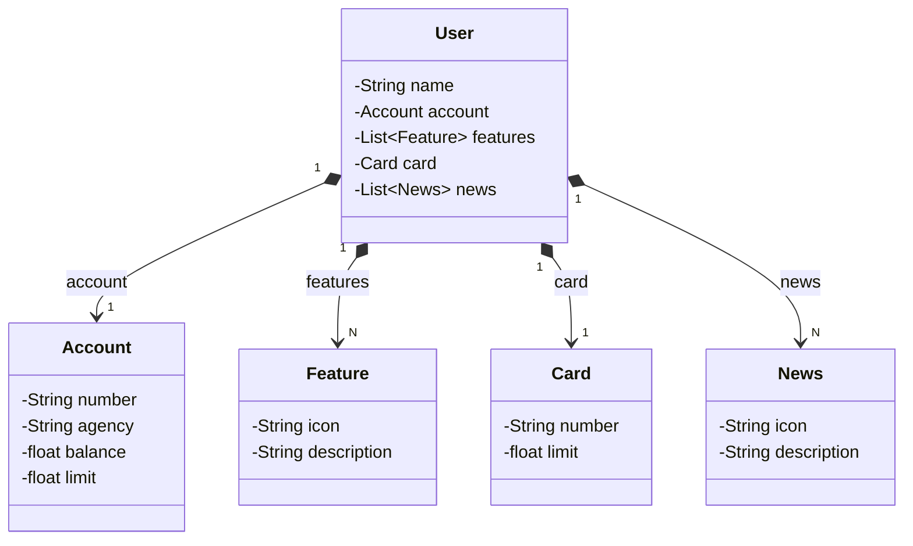

# Santander Dev
isso é legal

##Diagrama de classes

```mermaid
classDiagram
    class User {
        -String name
        -Account account
        -List~Feature~ features
        -Card card
        -List~News~ news
    }

    class Account {
        -String number
        -String agency
        -float balance
        -float limit
    }

    class Feature {
        -String icon
        -String description
    }

    class Card {
        -String number
        -float limit
    }

    class News {
        -String icon
        -String description
    }

    User "1" *--> "1" Account : account
    User "1" *--> "N" Feature : features
    User "1" *--> "1" Card : card
    User "1" *--> "N" News : news

```
